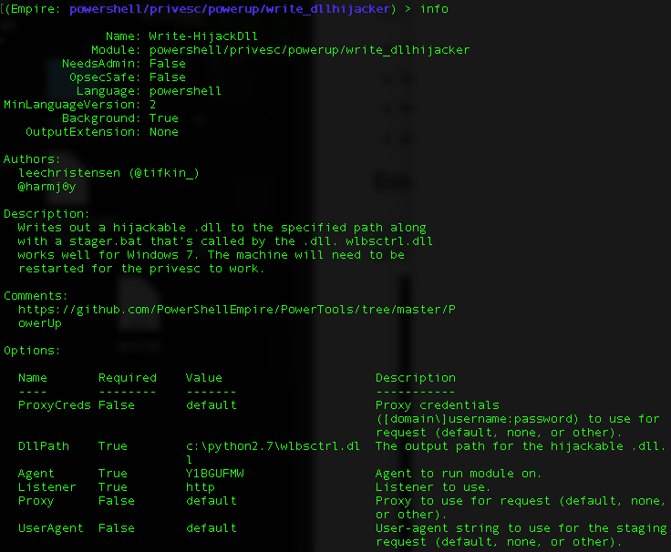
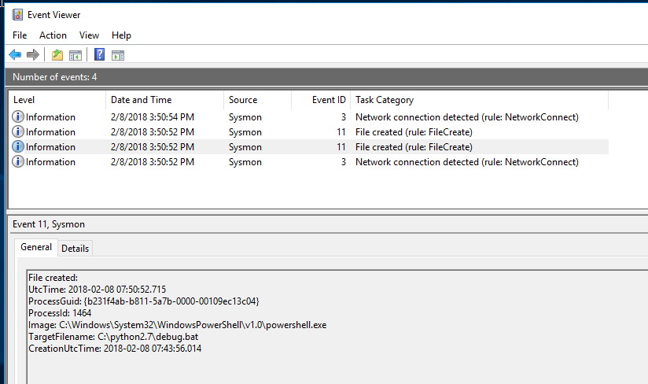
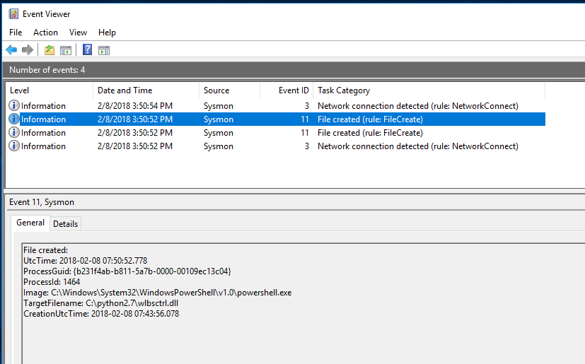

#Elevating Privilege & Persist by Exploiting Weak Folder Permissions

## Background

For privileged persistence, there are typically two scenarios:

1. Escalate privilege first, then install the persistence
2. Persist or install the payload in such a way to gain escalated privilege

This sample is the 2nd case. http://www.fuzzysecurity.com/tutorials/16.html has very good write-up on this method, specifically related to IKEEXT (IKE and AuthIP IPsec Keying Modules) service which tries to load wlbsctrl.dll, which works well for Windows 7 machines. 

The other condition for this method to succeed is a user-writable folder that is in the System/User PATH environment. For the attacker to figure out these conditions will require Stage 3 - Internal Reconnaisance (information gathering).

More info: https://attack.mitre.org/wiki/Technique/T1038

##Empire

So for this sample, C:\python2.7 is the "weak" folder that is within %PATH%, thus in the DLL search order.  

## Observations

*Debug.bat* is an Empire Stager file. Notice the *Network Connections (Event ID 11)* before & after the file writes.

Next, the wlbsctrl.dll file is written. This DLL will in turn launch the Debug.bat after a reboot/start-up.

## Questions

* What are other services have missing DLLs?
* What are the "weak" or writable folders that are within %PATH%?

Although we may not find answers to these questions from the Sysmon events directly, we will most likely need to answer them after an alert from some host control when it alerts suspicious file writes similar to this. 

*Instead of getting analyst to do such additional information gathering, will it be more efficient if there is some form of automated scripting/APIs that queries the host(s) in question?*