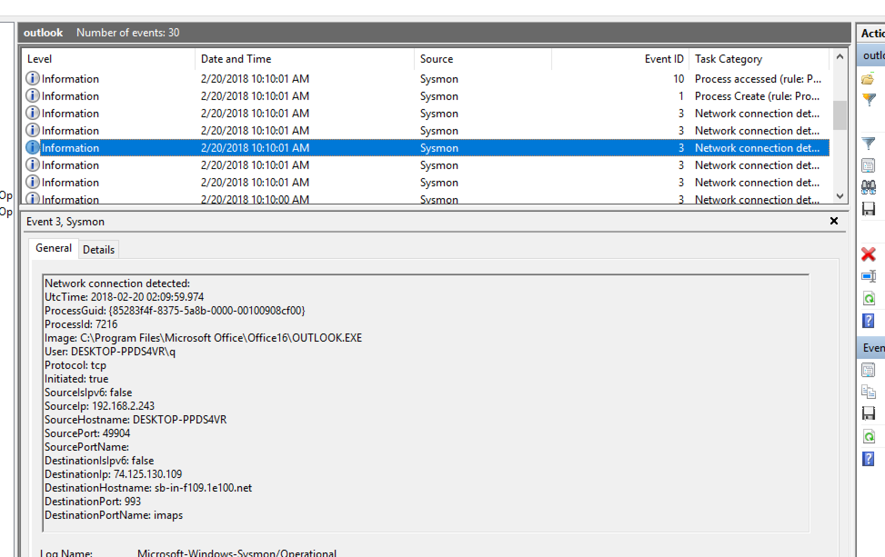

# Non-Beaconing External C2

If you were to use tools like Empire or Metasploit & observe the Sysmon logs, you will notice that there's quite a high count of Event ID 3 from the respective backdoor agents/processes. An organisations with good host instrumentation & sensors will most likely pick that up.

From the adversary's perspective, s/he may want to have another form of C2 that is not so easily spotted by analyzing periodicity & which processes are making network calls. It should be non-beaconing or event-driven. https://attack.mitre.org/wiki/Command_and_Control has a list of C2s but only [Communication Through Removable Media](https://attack.mitre.org/wiki/Technique/T1092) & [Remote File Copy](https://attack.mitre.org/wiki/Technique/T1105) are likely to be considered as non-beaconing.  

The Removable Media example is something like the alleged CIA Brutal Kangaroo Malware: https://thehackernews.com/2017/06/wikileaks-Brutal-Kangaroo-airgap-malware.html 

An example of **Remote File Copy** C2 could be a backdoor that only responds to a specific file activity. It is quite trivial to implement file/directory monitoring across platforms with tools like https://github.com/fsnotify/fsnotify.

## Outlook VSTO Backdoor

The example I will be sharing is related to Outlook VSTO backdoor PoC that I developed for product testing. *The payload installation sample Sysmon log can be found [here](https://github.com/jymcheong/SysmonResources/tree/master/6.%20Sample%20Data/stage%202%20(Get%20In)/3.%20install%20payloads/(Type%201)%20Abuse%20Outlook%20VSTO)*. 

### How does it work?

Step 0: [Install the Outlook VSTO backdoor add-on to Outlook](https://github.com/jymcheong/SysmonResources/tree/master/6.%20Sample%20Data/stage%202%20(Get%20In)/3.%20install%20payloads/(Type%201)%20Abuse%20Outlook%20VSTO).

Step 1: [Send a specially crafted email with a certain subject head with Powershell commands & delimiter](https://www.youtube.com/edit?o=U&video_id=e-rPstKk8rw).

Step 2: Outlook receives that mail but VSTO backdoor that hooks into new mail event & will: 

 * intercept the new mail
 * read the body contents to perform Powershell execution [WITHOUT launching Powershell](https://github.com/p3nt4/PowerShdll)
 * quickly delete the mail entirely, event from the "Trash" folder.

Step 3: Results from the earlier step is replied to the sender of the specially crafted email. Again, the sent mail is deleted entirely.

### Observations

**As far as network traffic is concern, there is honestly no way to differentiate Outlook communications with the backend (eg. Exchange server).** The only way is analyzing the text-body of the mail that in my case, contains Powershell commands. Again, it was just a quick PoC, a careful adversary will obfuscate the commands.

All we can see is Outlook making a IMAP over SSL.