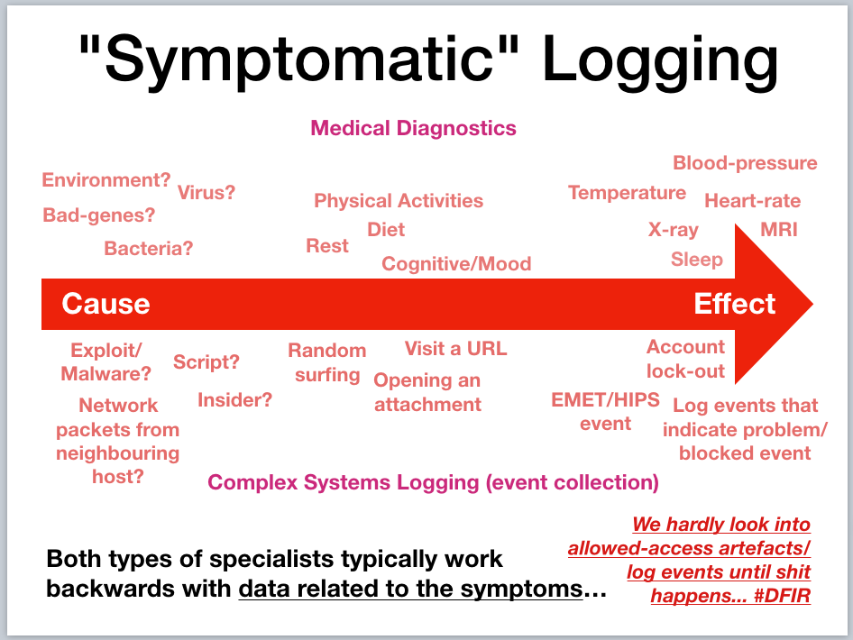

# Threat Analytics
Threat hunting is good but requires prior knowledge of offensive techniques & the [corresponding observables](http://stixproject.github.io/documentation/concepts/composition/) so as to know what to 'hunt'. How to deal with what you don't know? Since we won't know what we don't know, dealing with the unknowns may require some form of data analytics (another school of thought is the use of deception).

* [Cyber Analytics Repository](https://car.mitre.org/wiki/Main_Page) The Cyber Analytics Repository (CAR) is a knowledge base of analytics developed by MITRE based on the Adversary Tactics, Techniques, and Common Knowledge (ATT&CK™) adversary model.

* [Early Threat Warning Analytics](https://coggle.it/diagram/Wi9InZlx9wABS7-3/t/early-threat-warning-analytics/ca532fbf049b71fa2bb88d993e4c2641f87a9edec458c39bf14baca9bc67e682) A mind-map that I'd created to journal the various areas to detect.

* [Red Team Techniques for Evading, Bypassing, and Disabling MS
  Advanced Threat Protection and Advanced Threat Analytics](https://media.defcon.org/DEF%20CON%2025/DEF%20CON%2025%20presentations/DEFCON-25-Chris-Thompson-MS-Just-Gave-The-Blue-Teams-Tactical-Nukes.pdf) Not directly related to Sysmon but more to Microsoft threat analytics.

## Good vs Bad vs "I don't know"  
A viable approach is to learn what are known good/benign within a given environment so as to sieve out the known-bad & things that we have never seen before. After which, investigate those unknowns & turn them into known (either good or bad). Easier said than done for two main reasons:

1. How do we know if we are not learning the evasive bad stuff that's already running in the environment? I devised something to test EDR & threat analytics, basically an [Outlook backdoor using Microsoft Visual Studio Tool for Office](https://www.youtube.com/watch?v=e-rPstKk8rw).

2. Do we even have the "right" data to feed into the machine for learning? 

For the first question, analytics product vendors would have "teach" their machine with a representative environment (eg. a Cyber Range) that simulates typical user-applications & emulate offensive sequences. It further begs the question of how close this representative environment is to the actual production ones. So it is common that such products to have a "learning" period, so as to close the gap between the products' baselines & actual production environment.

I will touch more on the second question because garbage-in-garbage-out, also on typical flaws of sending events from security controls into a programmable IDS known as SIEM. The whole idea of threat hunting is a more dynamic & agile querying (think of it as fast [OODA](https://en.wikipedia.org/wiki/OODA_loop)) compared to the rather static rules/contents within a SIEM.

## "Symptomatic" Logging

I termed it as "symptomatic" because it is very much like medical diagnostics, you go to the doctor, talked about the symptoms (eg. sneezing, coughing), the doc measures temperature, blood-pressure & so on to make an assessment. 

In complex system event logging, similarly there's the tendency (especially the earlier generation of SIEMs) to record events that are related to the sypmtoms, that are emitted from security controls like Endpoint Protection (aka Anti-Virus), Windows Audit events like account logout, network IDS, firewalls & so on. 

If we look at it as a Cause-to-Effect "spectrum", such events are closer to the effect(s). There's alot of in-betweens going on that is unknown that are not captured thus making it difficult to work backwards to find out the root-cause even if the security controls were to be effective in alerting.

Of course, there are more mature organisation that goes to the extend of recording those "in-betweens" like endpoint & network telemetry (eg. using EDR & netflow/network forensics). This brings us to the next topic; linking the data-points together.

to be continued... 