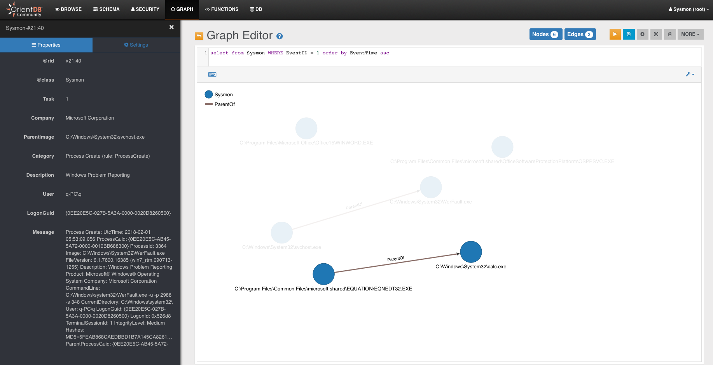

# Visualizing Sysmon Event

## Why not Neo4J?
Neo4j is a very popular graph database but there's some learning curve to the query syntax. I prefer OrientDB because it uses SQL like syntax & also it is a multi-modal (document, graph..) database.

## Caveats
[http://orientdbleaks.blogspot.sg/2015/06/the-orientdb-issues-that-made-us-give-up.html](http://orientdbleaks.blogspot.sg/2015/06/the-orientdb-issues-that-made-us-give-up.html) has plenty of bad things to say about OrientDB for production use. Nothing is free in life.

## How does it look like?

[Injectsysmon.py](https://github.com/jymcheong/SysmonResources/blob/master/5.%20Threat%20Analytics/orientDB/injectsysmon.py) is a basic sample script to insert events into OrientDB. For each Json line it inserts, it creates ParentOf edge with any earlier ProcessCreate events to form the relationship. Maybe there are more efficient ways of doing this but this is what I know now.

I also exported my sample DB into [Sysmon.gz](https://github.com/jymcheong/SysmonResources/blob/master/5.%20Threat%20Analytics/orientDB/Sysmon.gz) using OrientDB web-studio. Import requires OrientDB console (can't use browser), please refer to OrientDB manual.