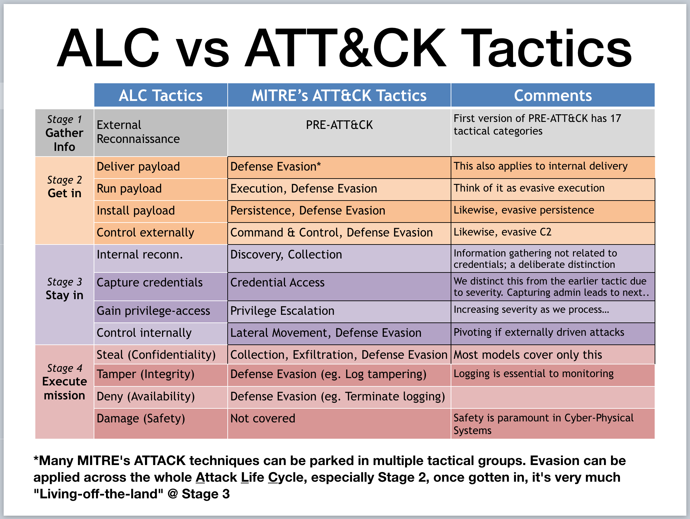

# Why do u bother?
Are you into pen-testing? Or a eager data-science student who is interested in cyber security? This idea that one has to be specialised or a "domain expert" to do someting is really an artifical glass-ceiling we put in our heads. You do it to become the domain expert!

So if you are into offensive, you want to see what data that are emitted that get you caught. And if you are into data-science, running a program like Winword isn't rocket science to get data for what is normal. 

I keep hearing that it is hard to get data from various groups of people, so I decided that once and for all, just put it here. 

# Sample Data Sets

Will be uploading sample sample Sysmon logs related to various aspects of an **A**ttack **L**ife **C**ycle. MITRE has a set of data from a [BRAWL Automated Adversary Emulation Exercise](https://github.com/mitre/brawl-public-game-001/tree/master/data) if you cannot wait.

MITRE's ATT&CK is a comprehensive enumeration of techniques grouped into tactical groups, but we wanted a model that was more easy to grasp in terms of wording & also to distinct between external & inside (stage 3 & 4) threats, & beyond breach of confidentiality:

We tend to use MITRE ATT&CK in our dialogue/engagementsWhen working with users who are more technical/savvy & prefer "branded" frameworks from more established organisations like MITRE, big-four consulting & the likes. But for all intent & purposes, our ALC is easier for communicating with non-technical stake-holders & is almost equivalent.

