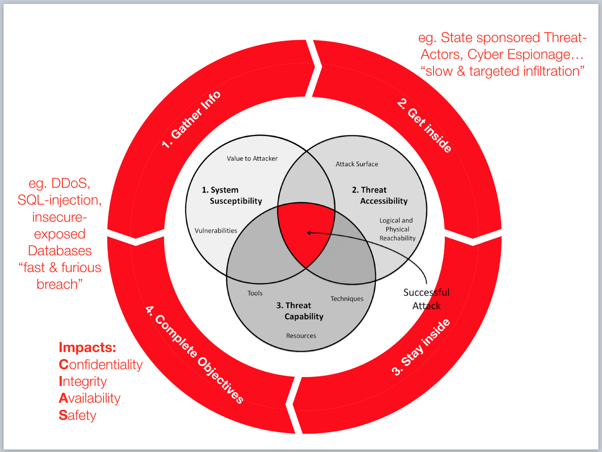

# Why do u bother?
I keep hearing that it is hard to get data from various groups of people, so I decided that once and for all, just put it here. I installed Nxlog-CE with the config (nxlog.conf.txt, need to rename) on various test Windows VMs to capture Sysmon events into individual Json lines.

Are you into pen-testing? Or an eager data-science student who is interested in cyber security? This idea that one has to be specialised or a "domain expert" to do someting is really an artifical glass-ceiling we put over our heads. You do it to become the domain expert!

So if you are into offensive, you may want to see what data that are emitted that get you caught. Or if you are into data-science, running a program like Winword isn't rocket science to get data for what is normal. Try a little [Kali & Metasploit](https://www.offensive-security.com), it's not that hard.

# Sample Data Sets

Will be uploading sample Sysmon logs related to various aspects of an **A**ttack **L**ife **C**ycle gradually. MITRE has a set of data from a [BRAWL Automated Adversary Emulation Exercise](https://github.com/mitre/brawl-public-game-001/tree/master/data) if you cannot wait.

MITRE's ATT&CK is a comprehensive enumeration of techniques grouped into tactical groups, but we wanted a model that is easier to grasp in terms of wording & also to distinct between external & inside (stage 3 & 4) threats, & beyond breach of confidentiality:

Our **A**ttack **L**ife **C**ycle model is based on [Dartmouth's 3-Tenets model](http://www.dartmouth.edu/~gvc/ThreeTenetsSPIE.pdf). The inner most Venn-Diagram illustrates the necessary-&-sufficient conditions for any Cyber-Physical attacks, think of it as all requirements must be present in order for the attack to be successful. When we look at it from the adversaries perspective:

1. In order to know about the Systems' Susceptibility, s/he must first Gather Information;

2. Depending on the value & vulnerabilities, s/he must then choose the appropriate offensive approach(es) to reach the target via its attack surface. In other words, Threat Accessibility;

3. And finally depending on the Threat Capabilities & Mission Objectives, s/he may complete the objectives right after gathering enough information or Stay Insider the network for further objectives.

The 4 Stages can be further expanded into related tactical groups: 

We tend to use MITRE ATT&CK in our dialogue/engagementsWhen working with users who are more technical/savvy & prefer "branded" frameworks from more established organisations like MITRE, big-four consulting & the likes. But for all intent & purposes, our ALC is easier for communicating with non-technical stake-holders & is almost equivalent.

