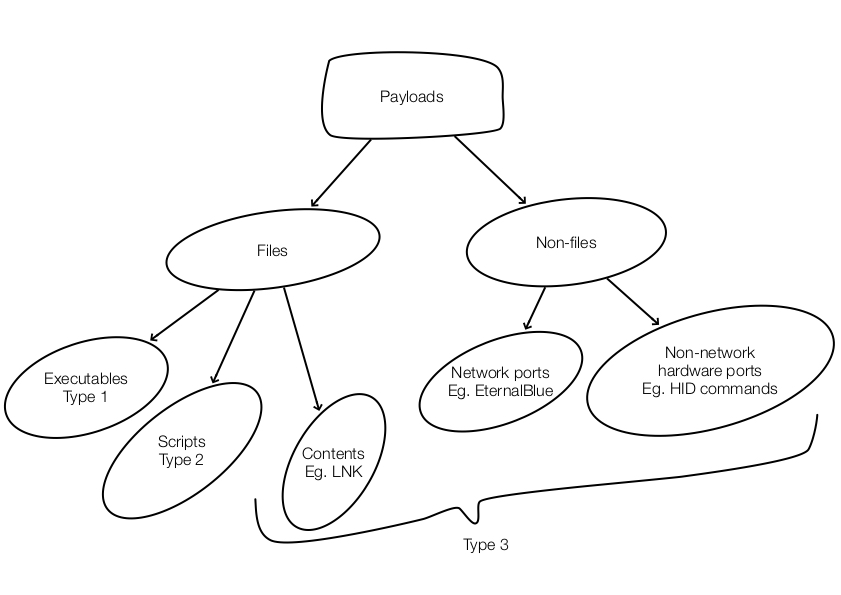

# How do "bad" things get in?

## Impossible to enumerate all techniques

*Payload Delivery* is related to the "Execution" tactics (https://attack.mitre.org/wiki/Execution). There are a myraid of techniques for different systems so it is unlikely to enumerate ALL techniques. One school of thought for dealing with *Payload Delivery* is to enumerate "bad" things & try to block them at network layer (blacklisting with signatures), be it in the form of files or packets. There are other defense methods beyond blacklisting & are more deterministic & reliable, but beyond the scope of this discussion.

## Further sub-divide payloads...

We can further "sub-divide" code-execution by asking something more fundamental: **"How to run codes on a computer?"**. Think of payload type as the "link" between delivery & execution: Compiled executables binaries (type 1), Scripts (type 2) & Others (type 3, typically with shell-codes hidden within malformed contents, or network packets/physical-port commands).  **Type 1 & 2 use features from the system whereas Type 3 are largely related to exploiting vulnerabilities.**

Relating back to an earlier point about "other defense methods", a reliable way beyond signature-based blacklisting is the neutralisation of *Type 3 - User Content payloads* using [Content Disarm & Reconstruction](https://en.wikipedia.org/wiki/Content_Disarm_%26_Reconstruction). Other novel approach include detecting machine-codes within User Contents (not executables or scripts) & deny such files altogether without having to decide whether it is good or bad codes.

## Payload Delivery

The sample logs here attempt to illustrate some common delivery tactics.

| Means to deliver payload         | Type 1 - Executables                                         | Type 2 - Scripts/Configuration-files          | Type 3 - Contents                                            |
| -------------------------------- | ------------------------------------------------------------ | --------------------------------------------- | ------------------------------------------------------------ |
| Email                            | Mostly should be blocked                                     | Possible to get through                       | Usually get through                                          |
| Browser                          | Possible to download depending on environment                | Possible to download depending on environment | Usually allowed to download                                  |
| Network or Physical device/ports | Embedded within packets. Direct execution as with HID attack. | Direct execution as with HID attack.          | In the form of packets or datagrams for network delivery, or files from removable storage device. |

In a end-user environment (client-zone), the most common element that one has to deal with is **files**. A malicious file can come attached in an email or just an URL that leads the user to view with a browser. There also cases where there are no explicit file per se, but somehow rendering specially crafted contents will cause the reader (eg. browser, PDF viewer) to run arbitrary codes.

In a server environment, listening ports will tend to be under attack, usually in the form of network packets. For web applications that accept user inputs, attacks are delivered either by web-UI form-elements or by HTTP(S) based RESTFUL APIs. 