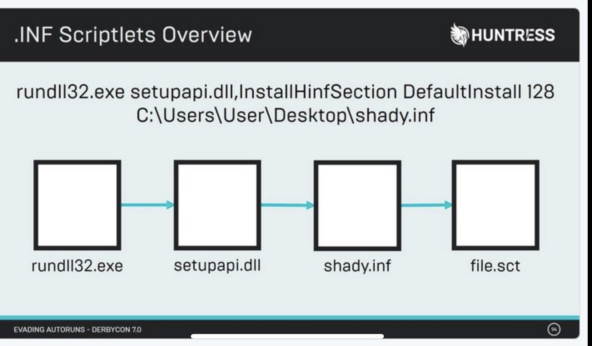
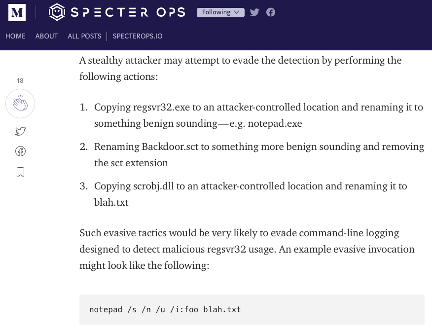

# Rundll32 Abuse

## Background
The Type 1s that I have highlighted so far are Portable Executables; one managed code (.NET) & the other native code (tainted winscp.exe). Catching unsigned programs that made weird connections out is low-hanging fruit. 

Rundll32.exe however, is a **signed** program (part of Windows) that can be called to execute an arbitrary binary... [https://attack.mitre.org/wiki/Technique/T1085](https://attack.mitre.org/wiki/Technique/T1085) (mitigations are in the MITRE link). I picked this to bring the point across that there are a number of ways in Windows to load DLLs from disk eg. [Search Order Hijacking](https://attack.mitre.org/wiki/Technique/T1038), [Side-loading](https://attack.mitre.org/wiki/Technique/T1073), abuse InstallUtil, Regsvcs, Regasm, regsvr32 & the list goes on, some are bugs but mostly are "features". 

## Payload Used
I used a LNK (link) file that calls a custom "Allthethings" managed DLL from Casey Smith [@subtee](https://twitter.com/subTee?ref_src=twsrc%5Egoogle%7Ctwcamp%5Eserp%7Ctwgr%5Eauthor) but integrated with Veil C# Metepreter reverse_https source into it. "Allthethings" DLL is a good test harness (depends on how you see things) to load other stuff like [Empire](https://github.com/EmpireProject/Empire) or whatever you fancy. It was shared for testing/evading application-whitelisting (eg. AppLocker) but Casey had since wiped that repository. Btw, this was executed on a fully patched updated (Windows Defender) Windows 10x64 VM.

Win 10 Mitigations: [https://posts.specterops.io/the-emet-attack-surface-reduction-replacement-in-windows-10-rs3-the-good-the-bad-and-the-ugly-34d5a253f3df](https://posts.specterops.io/the-emet-attack-surface-reduction-replacement-in-windows-10-rs3-the-good-the-bad-and-the-ugly-34d5a253f3df)

Another way to abuse Rundll32: [https://gist.github.com/KyleHanslovan/5e0f00d331984c1fb5be32c40f3b265a](https://gist.github.com/KyleHanslovan/5e0f00d331984c1fb5be32c40f3b265a)

## Observations
### Can't tell it was launch via LNK 
From log line #1, you can see the ProcessCreate event type with image field as full path to rundll32.exe & parent image being explorer.exe, **one can at best infer the windows explorer was at the foreground when this happened but we can't see or tell that LNK file was used**.

This test case was also one of the sparks that led me to develop a User-Action Tracking module because after a few EDR evaluation, I was frustrated with the fact I can't tell the difference between someone typing a rundll32 command *(who is to say that a savvy rogue admin can't pull this off?)*, clicking a link to it or was it launched with an exploit. *At least with the User Action tracking, I can tell it is either launched by typing or clicking, anything else should be an exploit.* 

### My DLL name was obvious but...
In the real world, adversaries will be creative when it comes to naming so as to make it blend in or look harmless. In fact you can give it any other extension & it still loads & runs. Also note that the HASH values are NOT the hash for the DLL but rundll32. 

Setting up rules/queries that pick up the string \*dll is ok but can be easily evade if the extension was something else or none. A better way is to  analyse the CommandLine which I will elaborate below.

A realistic attack tactic looks like this:

Even though that post is about abuse regsvr32, the same idea can be applied to rundll32.

### What happens when there's proxy server?
After the process creation, you can see network connection made from **lines # 3 & 4**. That address is my Kali VM **but when there's a proxy configured on the machine, the destination address will be the proxy's.**  

### So what's wrong?
So if you were to pay for a **E**ndpoint **D**etection **R**esponse system, **you probably want one that can tell you more than Sysmon** eg. record the LNK to that execution, capture DLL hashes/(un)signed & able to tell the true destination rather than proxy. But all is not lost with the Sysmon log. 

The CommandLine value is  `C:\\Users\\q\\Source\\Repos\\AllTheThings\\AllTheThings\\bin\\x86\\Release\\AllTheThings.dll, EntryPoint` is something to be concerned with. In my case it was rather obvious but **the question becomes "is it common to have such rundll32 loads from user writable paths?".**

Next, even if it is common that such rundll32 loads (which is honestly bad), **how many of such DLLs (we know it is a DLL even if it is named as doc) make network connections?** **So even without the ability to tell true destination, the Sysmon network connection events are still useful.** 

In this log sample, the first Rundll32 started another Rundll32 from Windows\SysWOW64. 

## Questions
This is not exhaustive set, just samples:

**What are the rare rundll32 commandlines parameters that create process(es) that make outbound network connections?**". 

**What other system tools that take in commandline parameters that make outbound network connections?**

**Do these parameters contain user-writable paths?**

Think of it another way, ask questions that "spans" across two tactical groups (Run payload & External/Internal Command & Control). So instead of writing a specific rule/query for each & every windows tools abuse (of course we should if we can), the machine analyses & highlights unknowns & let's you put a 'label' to it. 

## Other Reference(s)
[https://car.mitre.org/wiki/CAR-2014-03-006](https://car.mitre.org/wiki/CAR-2014-03-006)