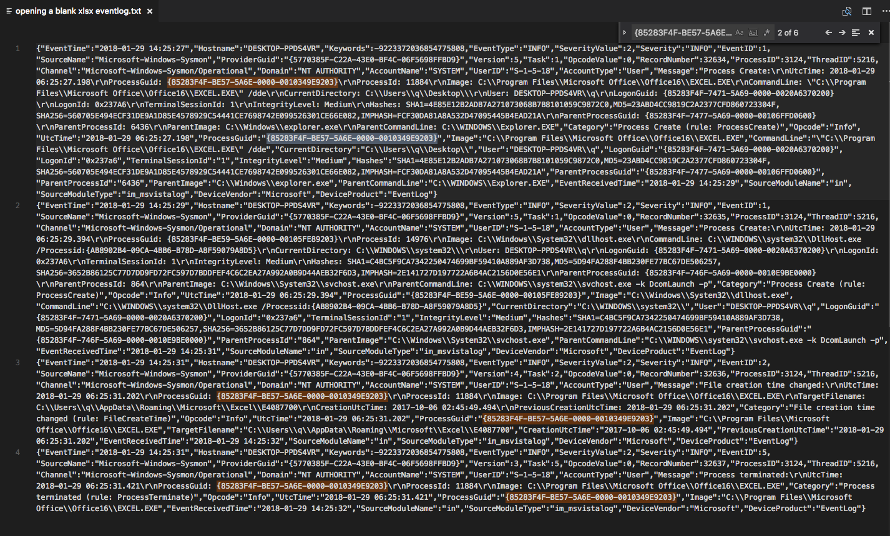
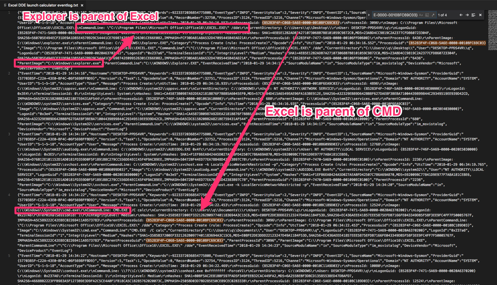
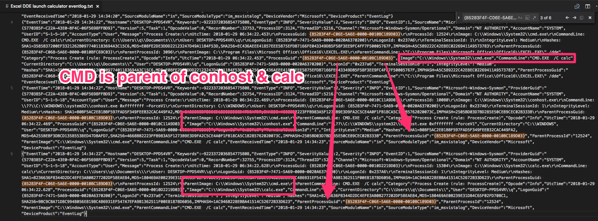

# Microsoft Dynamic Data Exchange Abuse
Excerpt from [Microsoft's Security Advisory 4053440](https://technet.microsoft.com/en-us/library/security/4053440.aspx) (headers & emphasis are added by me, not part of the original text): 

## What is it?
Microsoft Office provides several methods for transferring data between applications. The DDE protocol is a set of messages and guidelines. It sends messages between applications that share data, and uses shared memory to exchange data between applications. Applications can use the DDE protocol for one-time data transfers and for continuous exchanges in which applications send updates to one another as new data becomes available.

## Threat Scenario
In an email attack scenario, an attacker could leverage the DDE protocol by sending a specially crafted file to the user and then convincing the user to open the file, typically by way of an enticement in an email. **The attacker would have to convince the user to disable Protected Mode and click through one or more additional prompts**. As email attachments are a primary method an attacker could use to spread malware, Microsoft strongly recommends that customers exercise caution when opening suspicious file attachments.

## Payload
Instead of Outlook (email client), I used a [specially crafted CSV](https://github.com/jymcheong/SysmonResources/blob/master/6.%20Sample%20Data/stage%202%20(Get%20In)/2.%20run%20payloads/(Type%202)%20Abuse%20MS%20Excel%20DDE/calc.csv) that "pops a calculator", which is a popular test-case that some like to do to show arbitrary code execution. I want to use this set of log samples is to contrast the parent-child process chain between normal usage vs code-execution with DDE.

## Observations

### Opening a blank Excel file

1. [First line of "opening a blank xlsx eventlog.txt"](https://github.com/jymcheong/SysmonResources/blob/0d63062cda64217a235be78f246e709734e10c78/6.%20Sample%20Data/stage%202%20(Get%20In)/2.%20run%20payloads/(Type%202)%20Abuse%20MS%20Excel%20DDE/opening%20a%20blank%20xlsx%20eventlog.txt#L1) is a *"Process Create"* event for Excel. We can see the various related fields including ParentImage which is Explorer.exe. We can infer that the user launch it from Windows Explorer.

2. From that first log line, we can't tell what file was opened. For certain other Office apps, we may be able to see that from CommandLine, but somehow not for Excel.

3. There can be other events totally not related, which could be hard to eye-ball, especially with lines & lines of text. That's the main reason why Endpoint Detection & Response or whatever Threat Hunting solutions tend to visualise in some forms of graph or timeline. 

4. Since I am not visualising this, I used a text-editor & search with the ProcessGUID value. From the screenshot, we can see there are 6 matches, spanning across lines 1, [3](https://github.com/jymcheong/SysmonResources/blob/0d63062cda64217a235be78f246e709734e10c78/6.%20Sample%20Data/stage%202%20(Get%20In)/2.%20run%20payloads/(Type%202)%20Abuse%20MS%20Excel%20DDE/opening%20a%20blank%20xlsx%20eventlog.txt#L3) & [4](https://github.com/jymcheong/SysmonResources/blob/0d63062cda64217a235be78f246e709734e10c78/6.%20Sample%20Data/stage%202%20(Get%20In)/2.%20run%20payloads/(Type%202)%20Abuse%20MS%20Excel%20DDE/opening%20a%20blank%20xlsx%20eventlog.txt#L4).

5. Line 3 tells us that Excel changed a file's creation time.

6. Line 4 tells us that Excel terminated.

7. Between Excel Process Creation to Terminate, there's only a single pair of Parent -> Child relationship. Keep that in mind & contrast that to the following...

### Popping calc with DDE

1. When we put them together the Parent -> Child chain: Explorer -> Excel -> CMD -> Conhost & Calc

2. [Conhost is typically seen with CMD launch](https://www.howtogeek.com/howto/4996/what-is-conhost.exe-and-why-is-it-running/), doesn't matter if via Explorer or Excel.

## Questions
Some questions to ask:

1. How often is Excel (or the other Office apps) a parent process in your environment?

2. Is it typical to have Parent -> Child process-chains with >= 2 edges/links?

I used a simple example to launch calc.exe but it could have been more complicated in a real attack, which also means possibly longer chains.