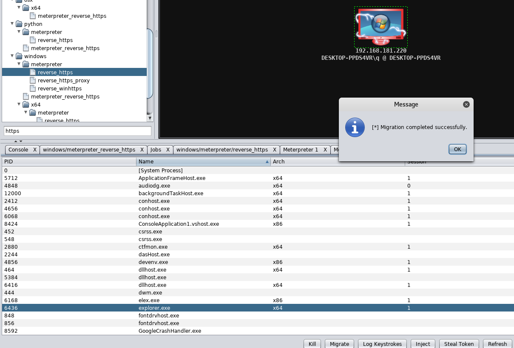
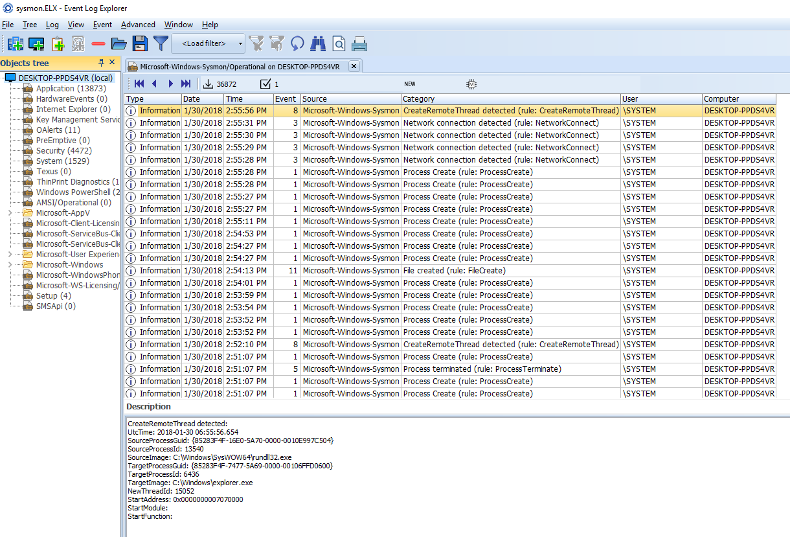

# Meterpreter Process Migration
## Background
Why bother to migrate the Meterpreter (or any other C2) session? For instance, after exploiting a browser or viewing a weaponized document, a user may close the application, so it is sometimes necessary to quickly migrate before one loses the session.

## Payload
I continued with the [Powerpoint mouse-over action](https://github.com/jymcheong/SysmonResources/tree/master/6.%20Sample%20Data/stage%202%20(Get%20In)/2.%20run%20payloads/(Type%202)%20Abuse%20MS%20PPT%20Mouse-over%20Action) but in this case, I turned on my Kali Meterpreter HTTPS listener so as to perform the process migration.

## Observation
Please note that Sysmon by default disabled ProcessAccess because it can be quite taxing on the system. It has to be turned on with a [Sysmon config file](https://github.com/SwiftOnSecurity/sysmon-config/blob/1c19d2b1d77056e5d6e60a2a60a006ed860bff4d/sysmonconfig-export.xml#L425).

I won't repeat the [observations for Powerpoint mouse-over chain of events](https://github.com/jymcheong/SysmonResources/tree/master/6.%20Sample%20Data/stage%202%20(Get%20In)/2.%20run%20payloads/(Type%202)%20Abuse%20MS%20PPT%20Mouse-over%20Action#observations), but the most interesting line in the log is related to CreateRemoteThread from Rundll32 to Explorer:

 

## Questions

* Apart from CreateRemoteThread, what other way(s) to cause another process to run more codes in memory?

* Do legit applications or system process create remote threads in another process?