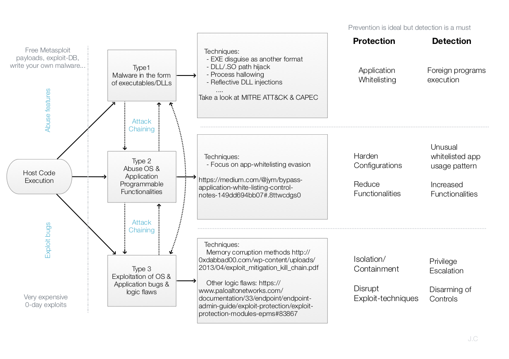

# Run payload (Execution)
The various sub-folders hold samples log from code executions observable with Sysmon. Most of the code execution will be based on Metasploit & Empire frameworks. For each payload type, I will also add resources to various public HOWTOs eg. payload generation, PoC source & so on.

**I am NOT trying to capture logs from all possible types of payloads** but rather some representative to help those who are new to Sysmon to better understand the significance of fields within various Sysmon Event types. I also include logs from normal application execution so as to help contrast the differences/deltas that we can observe from Sysmon Events. 

# Payload Types
There are various malware taxonomies & so on but I am getting old to remember too much. Instead, I grouped them into 3 types:

## Easy Classification

There's this hype with 0-day exploits (Type 3) that people overlook the basic things. By basic, I am refering to how a typical OS work. *Type 1 (Executables)* & *2 (Scripting)* are actually the usual & legitimate ways of running instructions/codes on a computer (observable with Sysmon events). Exploits are typically specific to OS types & version.  

## Attack Chaining

More importantly, techniques are often chained together. Shell-codes based payloads are typically much smaller payloads than let's say EXEs. As such, it is often done in multi-stages, eg. (old-school): exploit -> drop payload (more complex logic) -> run payload. 

The in-thing now is in-memory code-injection & abuse of legit system componets to evade protection & detection. Put it in any way, evasive attacks don't write to disk but cause another process to run more arbitrary codes in-memory &/or abuse system components to run larger malicious codes. 

Some may ask: Hey what happened to local/remote exploit & blah... that's under "Deliver payload" or Payload Delivery. Good examples of remote exploits would be things like HeartBleed & EternalBlue, both **delivered as packets** over the wire. But it gets confusing, then isn't a weaponized Word-doc or PDF "remote" exploit too since the attacker can send them to the target/victim? 

## Deliver -> Run

As such it makes more sense to de-couple the delivery mechanisms & payload types because there are different treatments/migitations. For instance, we can apply **C**ontent **D**isarming & **R**econstruction for Type 3 (non-EXE/Scripts), Since we can't CDR on installers & system scripts, for larger organisations where there are proper channels for software deployments, we can then use controls that are better at detecting bad programs & scripts than try to expect a silver bullet to solve everything. 

## Abuse of Feature != Exploitation of Bugs

I prefer a clear distinction between **exploiting of bugs** & **abuse of features**. Vulnerabilities can be divided into 3 classes: Design, Implementation & Configuration with the first being the most serious & joked as "It's a feature, not a bug!". If it were a implementation flaw (bug), we can expect a fix via patching, if it were a configuration issue, we can harden/change. But if it is a design flaw (feature), good luck or change the product altogether or make a big hoo-ha for negative publicity (eg. Intel Meltdown & Spectre).

The sample-logs in the various folders will attempt to use actual data to illustrate each types. **Just to be clear, anything that is not EXE & Script falls under Type 3, which includes things like HID command injection, network packet based exploit like HeartBleed, ExternalBlue & so on.**