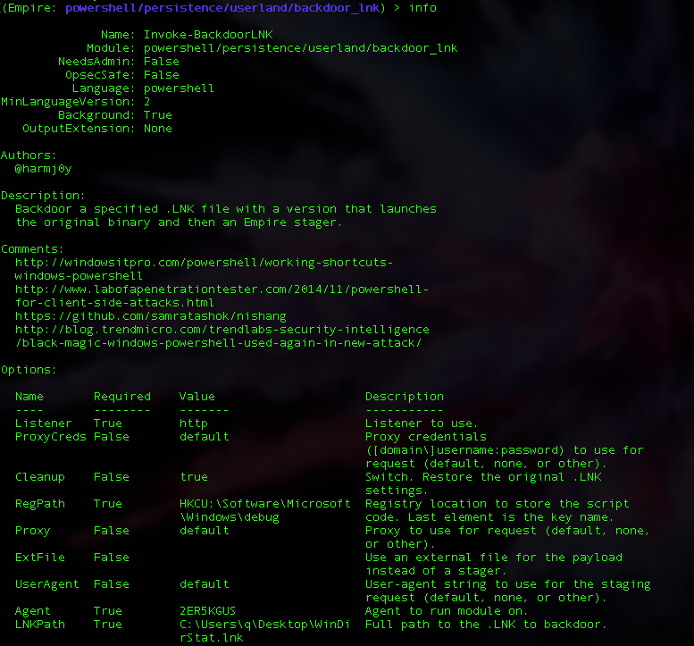
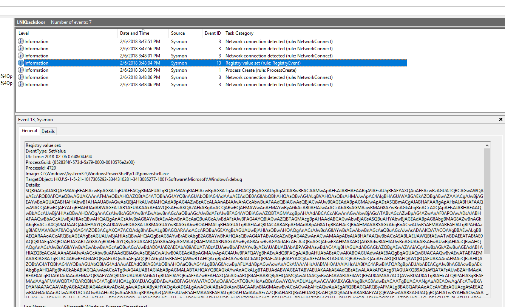

# LNK Poisoning

## Background
Windows users will tend to create shortcuts, which are LNK files & since these files are user created, it means they can be over-written. 

## Empire Module
[Empire](https://github.com/EmpireProject/Empire) is a post-exploitation framework. By post-exploitation, it means after the initial payload execution & gaining Command & Control (or C2) session with the target machine.

This module does not store any payload as files. It uses a registry path as defined in the field RegPath to store the payload that will be executed when user clicks the poison LNK-shortcut (eg. web browser shortcut). In [another sample](https://github.com/jymcheong/SysmonResources/tree/master/6.%20Sample%20Data/stage%202%20(Get%20In)/3.%20install%20payloads/(Type%202)%20Abuse%20userland%20schedule-task), I used **A**lternate **D**ata **S**tream instead of registry storage. 

## Observations

From the screenshot, we can see that the registry set-value event is preceded by a couple of network initiated (by Empire Powershell implant) events. 

The *Details* field of registry set-value event shows a huge chunk of Base64 encoded payload. The poisoned LNK is modified to run Powershell to run both the original software & use this payload for persistence. 

Btw, this is executed on a fully patched/updated Windows 10 Enterprise test VM. No Windows Defender alert whatsoever.

## Questions
* Where are the file events (Event ID 11)?
