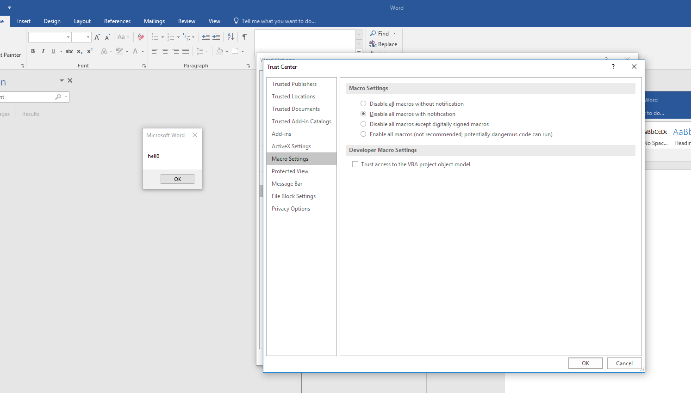
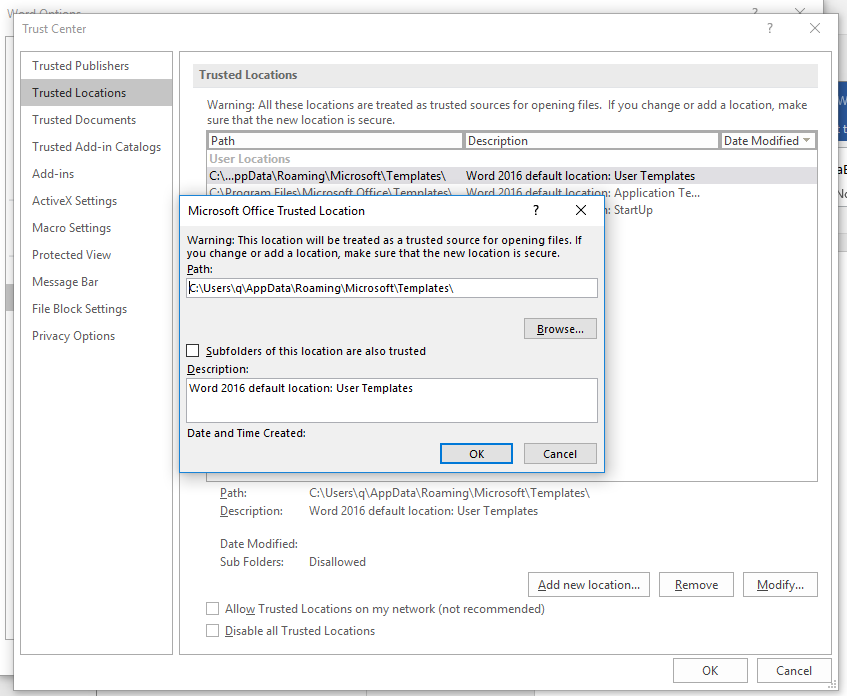
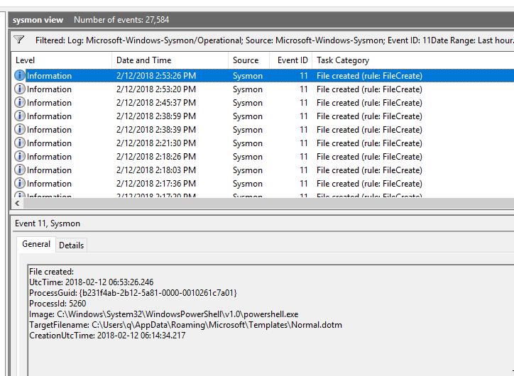
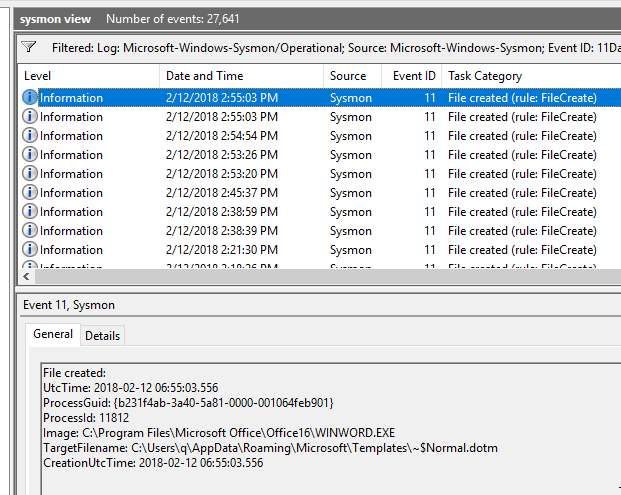
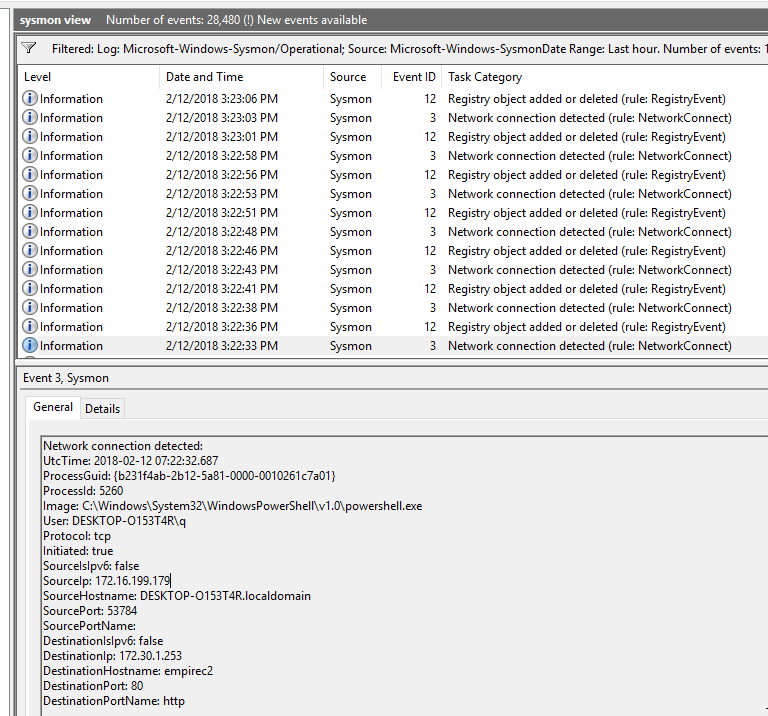

# Winword Normal.dotm Poisoning

## Background

Normal.dotm is a Winword 2016 template is stored at C:\Users\USERNAME\AppData\Roaming\Microsoft\Templates folder. It can be overwritten without admin rights. This sample is very similar to [LNK poisoning](https://github.com/jymcheong/SysmonResources/tree/master/6.%20Sample%20Data/stage%202%20(Get%20In)/3.%20install%20payloads/(Type%201)%20Backdoor%20a%20userland%20LNK%20file). 

By default (without hardening), Winword will trust the template despite setting a restrictive Trust Setting like below:

The template path is in a Trusted Location (below) which supersedes the setting above:

## Empire Command

Persisting in such an environment is simply an upload command as shown above. We basically overwrite the file.

## Observations

* **This is probably the only sample that has no log because there wasn't any File Create Event (id 11) from Powershell process**. 

* Again, the Sysmon configuration **filtering did not include .dotm**, so I added & updated the Sysmon service filtering. 

* I then removed the original Normal.dotm in the Templates folder,  then did an Empire upload. As shown below, Sysmon recorded the File Create event.

  

* We can "reset" Normal.dotm to a clean state by deleting it & launching Winword, you will observe:

  

* In fact, every time Winword is launched, a shadow file will be created.

* I ran the Winword to check that there was no pop-up message so that we know it was "cleaned".

* So we are clear that the Sysmon configuration filtering included .dotm & template is clean, **I repeated the Empire upload command to overwrite Normal.dotm; NO File Create event.**

* To confirm that the overwriting was successful, I launched Winword after the Empire command was completed & saw that there was the "hell0" pop-up.

* To double check this observation, I went on to use Empire to overwrite a blank dotm file on the target desktop. Again, it only recorded Explorer.exe creating the file but not Powershell overwriting the blank file.

## Conclusion

* Sysmon File Create event does not cover file modification.
* We won't be able to track over-writing of other templates for various Microsoft Office Suite with Sysmon File Create event.

All is not lost, there are other indicators to watch out for, for instance:

which leads us to another stage of the Attack-Life-Cycle/Kill-Chain; external C2 (Command & Control) [macro abuse](https://github.com/jymcheong/SysmonResources/tree/master/6.%20Sample%20Data/stage%202%20(Get%20In)/2.%20run%20payloads/(Type%202)%20Abuse%20MS%20Winword%20Macros).