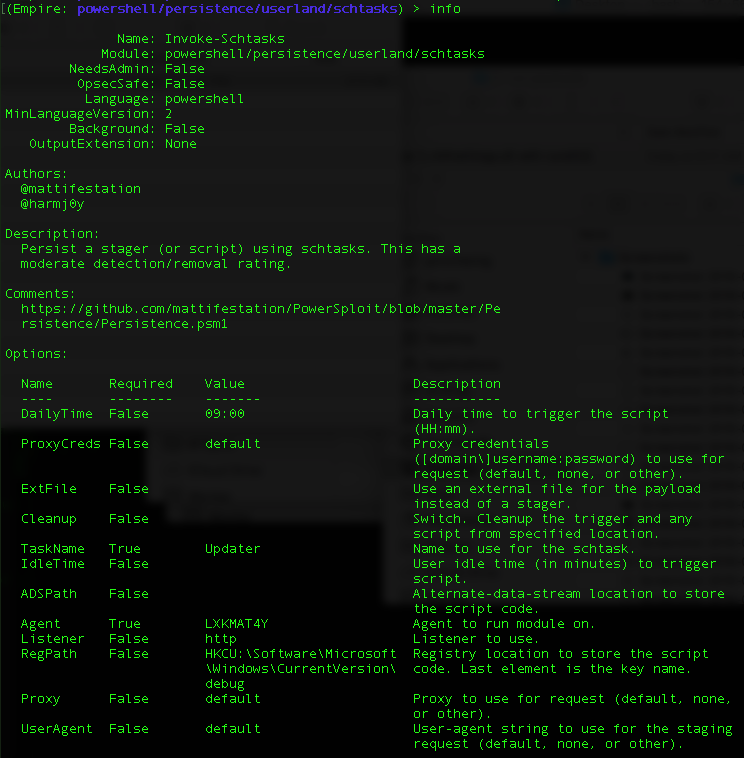
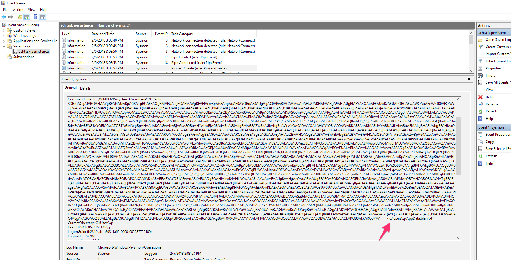
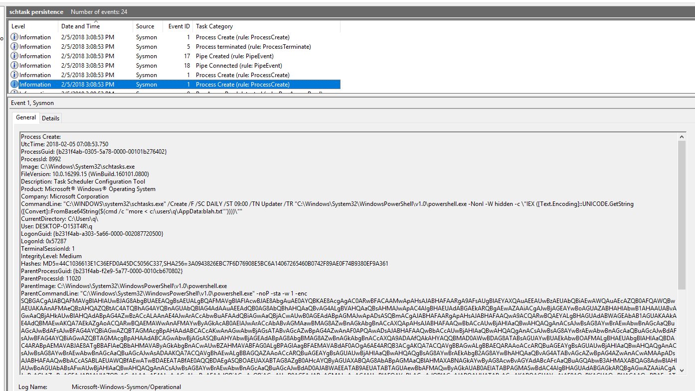
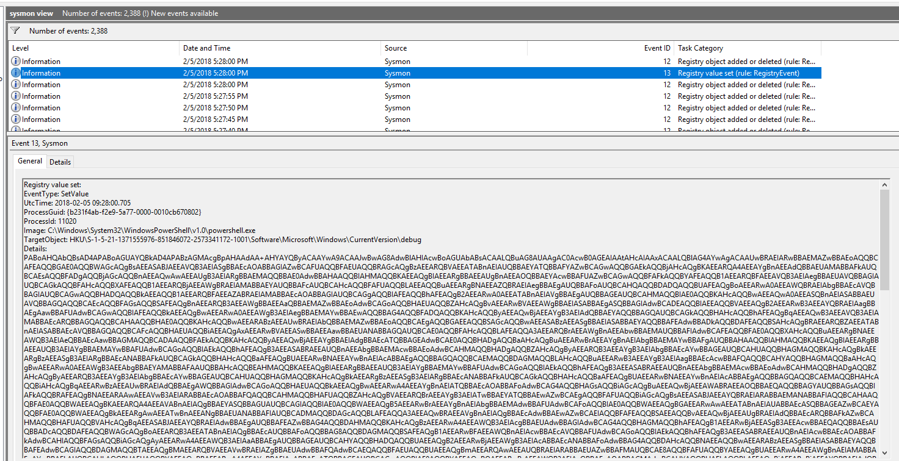
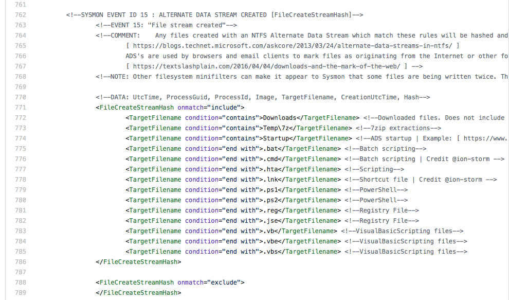

# Abuse schtask
## Background
Standard users (non-admins) can create scheduled tasks & these tasks can run programs abeit within user's privilege-level.

More info: https://attack.mitre.org/wiki/Technique/T1053

## Method

I will not record the initial payload execution which leads to the [Empire C2](https://www.youtube.com/channel/UCOn5uwA42XWUnrjTilwG0xg) session but only logs related to the backdoor installation. Notice for this module, we can set ADS & Registry paths. 

## Observations

1. From the EVTX file, we can observe the initial Powershell network communication to the C2 server

2. Followed by creation & connection to an anonymous PIPE by the same Powershell process

3. The first Process Create event has a huge chunk of base64 encoded string as shown in the screenshot above. But the most important part is the end, where it pipes to an Alternate Data Stream path ` > c:\users\q\Appdata:blah.txt`. Scroll down further...

4. We will notice yet another set of PIPE create & connect followed by Create Process events, one Create Process has parentimage of SearchIndexer so it has nothing to do this offensive Powershell process. The next Create Process however shows CommandLine with `schtasks.exe ... Appdata:blah.txt`. So it's clear it has to do with the payload installation steps.

5. Once schtasks.exe terminates (Event ID 5), we see Powershell initiates network connection out. 

Many of these pen-testing/offensive toolkits will use PIPE to get the result from spawned processes, as shown in this example. The general pattern for tools like Empire/Metasploit:

[Commands transport from C2 via network to the backdoor process] -> create & connect PIPE -> [new processing] -> [result from launched process sent via network back to C2]. *In the case of Empire, it seems that PIPE is involved whenever the module runs in the background (ie. Background: True).* 

In between the [new processing], we may see other things like RawRead, Registry access & so on. 

## Question(s)
### Why is there no Registry modification event !?
One part has to do with Empire, when ADSpath is used, it won't use a script which is loaded via ExtFile & stored at RegPath. Next part, the Sysmon configuration I used had filtered out the event.

To confirm that it is really the case: I added `<Image condition="contains">powershell</Image>` under the Include section, reloaded the Sysmon configuration, updated the relevant Empire module fields & then rerun the persistence module:

### Why is there no ADS Created Event?
Again, the Sysmon configuration I used had filtered it out, only managed to infer from the Process Create event. The screenshot below is an excerpt of the Sysmon config file:

Since I was using a .txt file, it will NOT be included, which begs the next question...

### What other events that are relevant but filtered out?
This is a tough question. For the fact that such configurations are in public domain like Github, an adversary can devise clever steps to evade by not being filter out some of the "broader" inclusion &/or exclusion conditions. The earlier example is one such instance. 

If we don't filter at all, there will be really many events. For instance, Registry events are really noisy. *It becomes a matter of trade-off especially when one does not have that bandwidth & processing to deal with the volume of data*. Updating the Sysmon configuration remotely for a large fleet of endpoints may also be challenging in many cases. This may also be one of those reasons why some would prefer [EDRs](https://www.gartner.com/reviews/market/endpoint-detection-and-response-solutions).