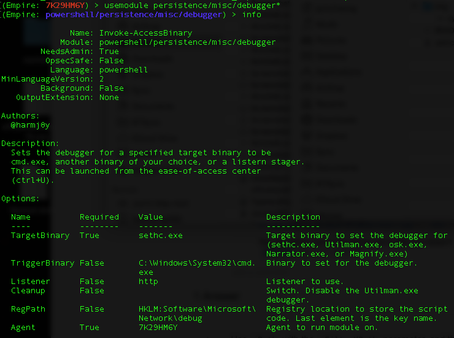
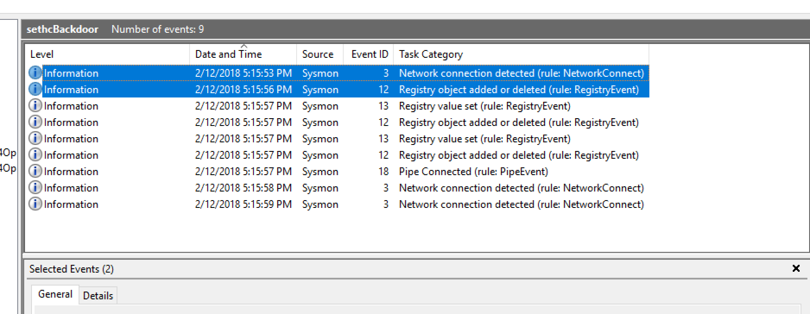
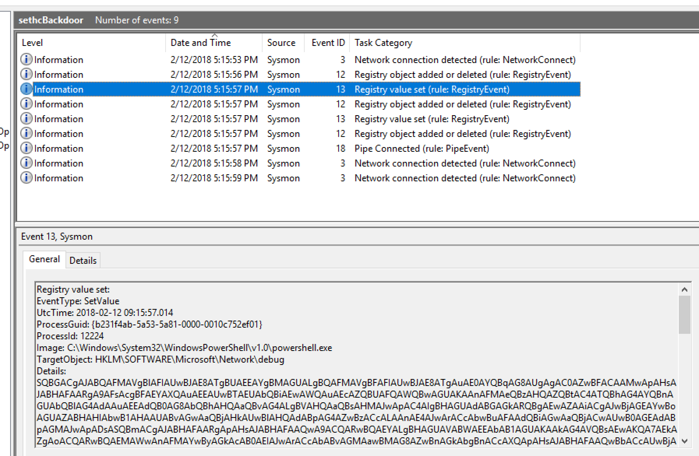
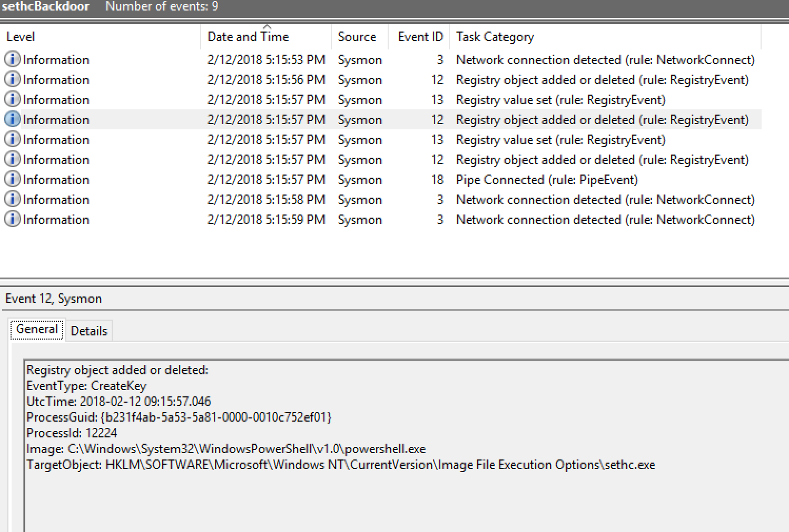
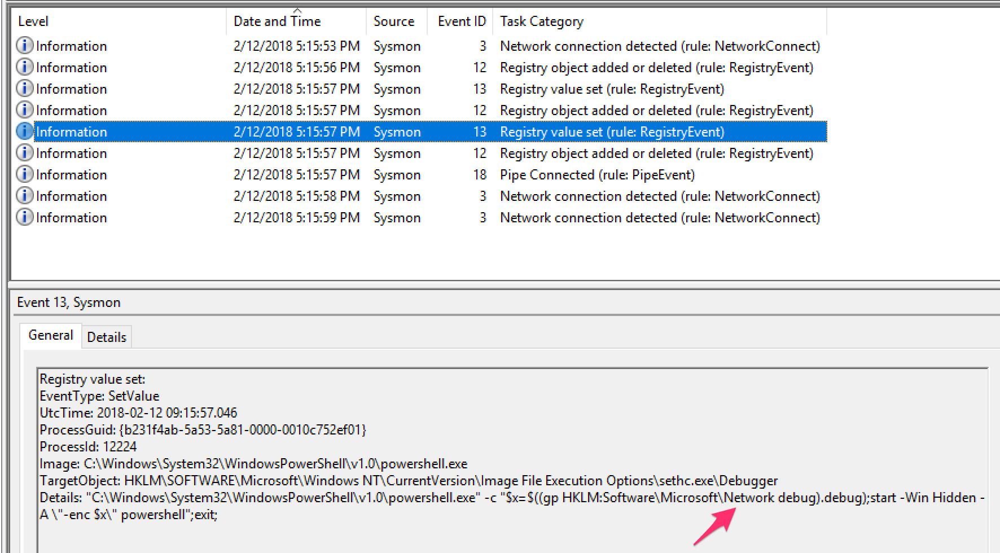

# SETHC.exe Elevated Backdoor

## Background

Sethc.exe is a process associated with Windows NT High Contrast Invocation and is part of Microsoft® Windows® Operating System. With default Windows settings, this process is run when the shift is pressed 5 times in sequence, to invoke the StickyKeys configuration window. 

More info: https://attack.mitre.org/wiki/Technique/T1015

## Empire Module

The Empire module sets up debugger to launch powershell to start a new elevated C2 session whenever sethc.exe is executed. When we press Shift button 5 times, we will get an Empire session running under logon user context. But if it were pressed at the Windows logon screen, we get a privileged session as shown below:

Notice 2nd row, Username that is SYSTEM. This type of backdoor is commonly used with RDP. 

## Observations

This log sample is related to the installation of backdoor, not the triggering of the SETHC backdoor which will be left in another sample in Stage 3 - Escalate Privilege. So let's dig in:

* The first 2 events (Event ID 3) of the 9 lines are related to Powershell making network connections. Event 12 tend to follow after Network Connection Detection for Powershell making outbound connections.

  

* Next, the Empire stager was written into the registry *(notice that TargetObject matches the Empire module setting earlier )*

* [Image File Execution Options](https://blog.malwarebytes.com/101/2015/12/an-introduction-to-image-file-execution-options/) (*referring to TargetObject registry path*) are used to intercept calls to an executable. The intended use is for debugging or for replacing applications. The Empire module performed 1st step of the two for setting up interception of SETHC.exe

* The next step added the *Debugger* value. Looking at the *Details* value, **that registry path (pointed by the arrow) is the same path as the very first set registry value (Event ID 13)**. That 1-liner script in *Detail* reads & executes encoded stager whenever sethc.exe runs.
* The next two events ID 12 & 18 are not so relevant. The former is related to Empire powershell process making network connection. The latter is not related to powershell process.
* The last two events are Empire powershell process making calls back to the C2 (empirec2 host).  

## Questions

* Is it common to have **I**mage **F**ile **E**xecution **O**ptions registry path created/modified in your environment?
* How many such IFEO keys exist out-of-the-box?