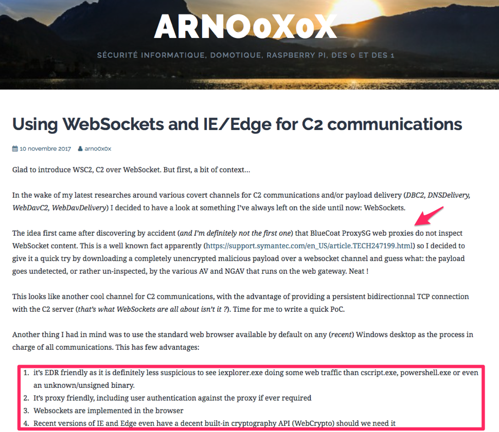

# External C2 over Websocket

## Background

http://blog.teamtreehouse.com/an-introduction-to-websockets WebSockets provide a persistent connection between a client and server that both parties can use to start sending data at any time. Depending on how it is implemented, it may or may not have heartbeat between server & client. That being said, some web proxies may interfere with Websocket communications. 

This log deserves more attention since it differs from usual beaconing C2. In fact, it is likely possible for Websocket to do both beaconing & event-driven C2. I started thinking about WebSockets after I saw its use-case in real-time web app developments. The darker side of me saw its other applications & I realize I was not alone...

## Offensive Tool

https://github.com/Arno0x/WSC2 The source code of this tool. A more detail write-up can be found here: https://arno0x0x.wordpress.com/2017/11/10/using-websockets-and-ie-edge-for-c2-communications/. 

I took an excerpt from that page:

1. The controller runs a Web/WebSocket server as well as a command line interface allowing the attacker to enter commands for the agent
2. The agent runs on the victim’s machine and executes any instructions it receives from the C2, interacting with a browser process handling all communications with the C2 server
3. The browser process (*Internet Explorer/Edge*), controlled through a COM interface, handles all communications between the agent and the C2 server over a WebScoket channel

So with these high-level info in mind, let's look at the logs

## Observations

* The first event within the EVTX log file is the Process Create (ID 1) event for the 1-liner Powershell agent for WSC2.
* Notice the bunch of events between the first Process Create to the next, the Powershell agent drops another Powershell script (ID 11).
* After that, there will be 3 IExplorer.exe processes created. There are all invisible to the user (looking at my victim VM) but yet none of these browser processes are child to the initial Powershell. You will notice that the very first IExplorer has "[-embedding](https://docs.microsoft.com/en-us/previous-versions/windows/internet-explorer/ie-developer/general-info/hh826025(v=vs.85))" switch in the CommandLine field. That switch means starting IE as a web control *(OLE programming thingy, not the control we talk of in security)*. 
* I won't be going into details with the code-execution sequences but will focus on a key difference between WSC2 & Empire C2.
* Now if you filter the log to only look at Event ID 3, you will find that there are only 4 events that indicated communications to Kali host. I also let it run much longer but not capture in the logs uploaded. **There is NO repeated Event ID 3 events from Powershell or these 3 IExplorer processes.** 
* Even if there were heartbeat messages from C2 to Agent, *it is unlikely to be recorded in Sysmon Event ID 3 since this event is about Network Connection Initiated*.
* This is unlike Empire or Metasploit C2 where you get periodic ID 3 events from the agent process.

## Questions

What happens if we observe this with Wireshark or network forensics?