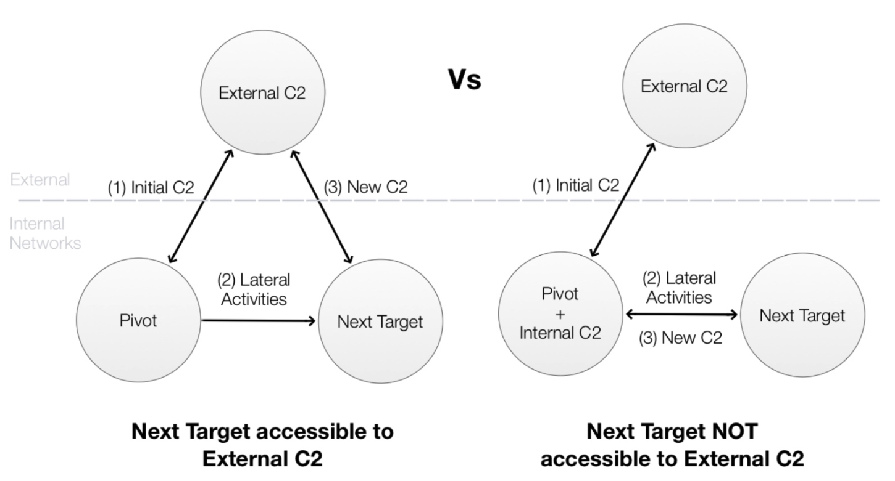

# External Command & Control (C2)

## Mitre's View on C2

From https://attack.mitre.org/wiki/Command_and_Control, Mitre sees it as various protocols & levels of covertness, but there's also an interesting statement from that wiki page: 

*"The resulting breakdown should help convey the concept that detecting intrusion through command and control protocols without prior knowledge is a difficult proposition over the long term."*

In my view, that statement is true but it also mean it is limited to those few general methods listed there. Which leads me to consider the other aspects of C2 that we may discern even if it is some form of unknown obfuscation/evasion within channels that are being monitored. A good example may be from [Mr Robot episode 4, connecting a Raspberry Pi to Steel Mountain's HVAC system](https://www.forbes.com/sites/abigailtracy/2015/07/15/hacking-the-hacks-mr-robot-episode-four-sam-esmail/#b5fee554503f).

## External vs Internal C2

I believe it is important to distinct between external from internal C2. *Why? For instance in an **air-gapped environment**, assuming the adversary managed to get a backdoor into the isolated machines, s/he still needs a channel for the compromised machine to communicate with. That by definition should be INTERNAL C2 since the controller will typically be within the targetted premises.* **It also means higher severity!**

## External -> Pivot -> Internal

External C2 on the other hand refers to remote-controlling machines that have some form of Internet access. There's also another important notion known as the 'Pivot', which we can think of as a *"stepping stone"* for the adversary to reach a neighbouring machine that has no direct internet access but is allowed to communicate with the compromised machine that is connected to the Internet. 

[In my Attack Life Cycle](https://jym.sg), I deliberately put Internal C2 as a Stage 3 tactic. From an incident response angle, sometimes we might totally missed External C2 but sensors may flag something suspicious between internal hosts.

## Beaconing vs Non-beaconing

Many of these backdoors & malware tend to call-back to the C2 server for the next instruction. This periodic communication is sometimes known as beaconing. The frequency could be short or over a longer period depending on the offensive tools (aka *periodicity*).

The samples in this sub-folder is organised into these two general types. There could be various communication protocols used. The most covert ones are those that **are not being monitored**, sometimes also known as "*side-channels*" eg. heat, lights blinking etc see BGU's research, link below. 

***Why divide into these classes?*** Some benign programs are known to beacon, eg. software updater processes & the likes. Rare programs (identified by their hash checksums) that beacon regularly are low-hanging fruits to catch. Non-beaconing types that are event driven are trickier & may require network packet inspection. With the advent of TLS/SSL, it does not make things easier.

I don't have samples for "side-channels" but an interesting list of air-gap circumventing research can be found at: https://cyber.bgu.ac.il//advanced-cyber/airgap 

