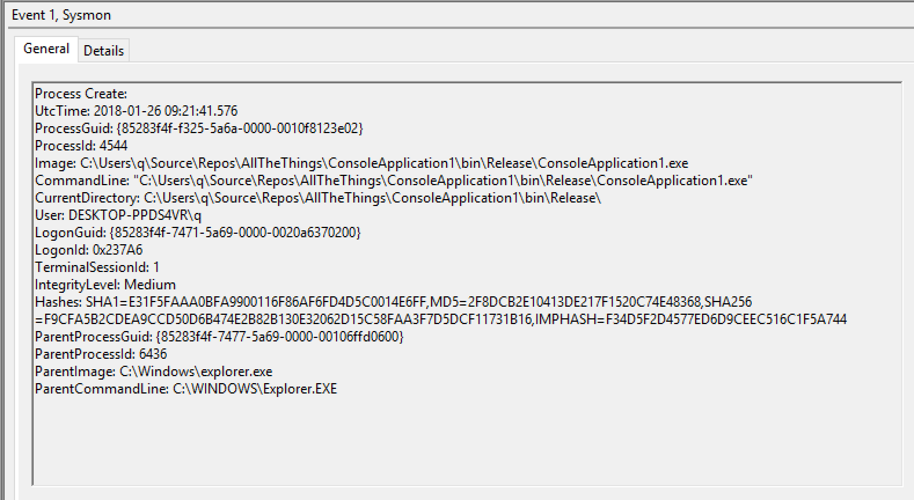

# Unsigned Binaries

## Background
This type (one) is essentially an unsigned PE that makes outbound network connections, doesn't matter if it is external or intranet destination.

**It will be painful to figure out which is benign or malicious** just from Process Creation & Network Connection event types in an environment without application whitelisting/control.

## Payload Used (Veil Intro)
[Veil](https://github.com/Veil-Framework/Veil) is a tool designed to generate metasploit payloads that bypass common anti-virus solutions. If one were to do a realistic test on an updated VM installed with a decent AV, most likely the payload would be caught. I personally prefer to use C# source but you can go for any payload types within Veil so long it doesn't get caught by AV. 

HOWTOs: [https://www.youtube.com/watch?v=3WPoD8F5V64](https://www.youtube.com/watch?v=3WPoD8F5V64)

## Observations

### Process Create (Event ID 1)
The first line of "Veil payload eventlog.txt", you will see (each line is) a Json output of Nxlog reading from Sysmon log channel. In Window Event Viewer, it looks like the following:



If you compare with the Nxlog output, you will notice there are more fields. For the moment let's ignore them & look at those there are listed in the screenshot. I will rip off some text from official Sysmon site & add my own comments with regards to the fields:

* Includes a *process GUID* in process create events to *allow for correlation of events even when Windows reuses process IDs*. 

* Include a *logon GUID* in each events to *allow correlation of events on same logon session*.

* Image & CommandLine seems to be the same in this case, *but it can be different. The significance of the latter will be highlighted in other payloads.*

* I configured Sysmon to *compute ALL hashes (may not want to do that in a production environment)*. The hash values can be used to search against threat-feeds for "known-bad" alerts.

* The parent process details are there. In this case, we see that this payload is started from Explorer.exe process. This parent-child process relationship is important in anomaly hunting. It is usually visualise as a chained (parent->child->grand-child) graphs in many detection products & opensource wares. [Sysmon View](https://nosecurecode.blog) [Sysmon & Neo4j](https://www.malwaresoup.com/sysmon-and-neo4j/). You will also notice the next line #2 is also a ProcessCreate event (connhost.exe, child of ConsoleApplication1.exe).

* TerminalSession is 1 which is the same as Explorer.exe. *In some code-execution cases, a non-transient program (eg. notepad or calc) can be launched in another TerminalSession. The changes of TerminalSession of parent to child is also something to look out for.*

* User & IntegrityLevel fields are useful for spotting credential abuse & escalation of privilege (eg. CMD suddenly running as SYSTEM)

* **You can't tell if it is signed or unsigned from Sysmon, that's why some would pay money for a detection that can do that.**

### Network Connection (Event ID 3)
Log line #3 (subset fields): 

```
{
	"EventTime": "2018-01-26 17:21:43",
	"Hostname": "DESKTOP-PPDS4VR",
	"Keywords": -9223372036854776000,
	"EventType": "INFO",
	"SeverityValue": 2,
	"Severity": "INFO",
	"EventID": 3,
	"SourceName": "Microsoft-Windows-Sysmon",
	"ProviderGuid": "{5770385F-C22A-43E0-BF4C-06F5698FFBD9}",
	"Category": "Network connection detected (rule: NetworkConnect)",
	"Opcode": "Info",
	"UtcTime": "2018-01-26 09:21:42.818",
	"ProcessGuid": "{85283F4F-F325-5A6A-0000-0010F8123E02}",
	"Image": "C:\\Users\\q\\Source\\Repos\\AllTheThings\\ConsoleApplication1\\bin\\Release\\ConsoleApplication1.exe",
	"User": "DESKTOP-PPDS4VR\\q",
	"Protocol": "tcp",	
	"Initiated": "true",
	"SourceIsIpv6": "false",
	"SourceIp": "192.168.181.221",
	"SourceHostname": "DESKTOP-PPDS4VR.localdomain",
	"SourcePort": "50557",
	"DestinationIsIpv6": "false",
	"DestinationIp": "192.168.181.197",
	"DestinationPort": "443", <--
	"DestinationPortName": "https", <--
	"EventReceivedTime": "2018-01-26 17:22:49",
	"SourceModuleName": "in",
	"SourceModuleType": "im_msvistalog",
	"DeviceVendor": "Microsoft",
	"DeviceProduct": "EventLog"
}
```
This particular payload starts a Meterpreter HTTPS session with my Kali VM (192.168.181.197). Notice the source & destination are in the same IP range.

**If your environment uses a proxy server, then the destination will be the proxy server's IP & port.** 

***A decent detection/threat-hunting system should show the true destination***

## Questions
This is not exhaustive set, just samples:

**What are the usual parent-child process pairs?**

**What are the rare binaries (image hash vs seen on number of unique hosts) that make outbound network connections?**. 

Think of it another way, ask questions related to the relationship between fields & "spanning" across (or more) tactical groups (Run payload & External/Internal Command & Control). So instead of writing a specific rule/query for each & every windows tools abuse (of course we should if we can), , the machine analyses & highlights unknowns & let's you put a 'label' to it. 
